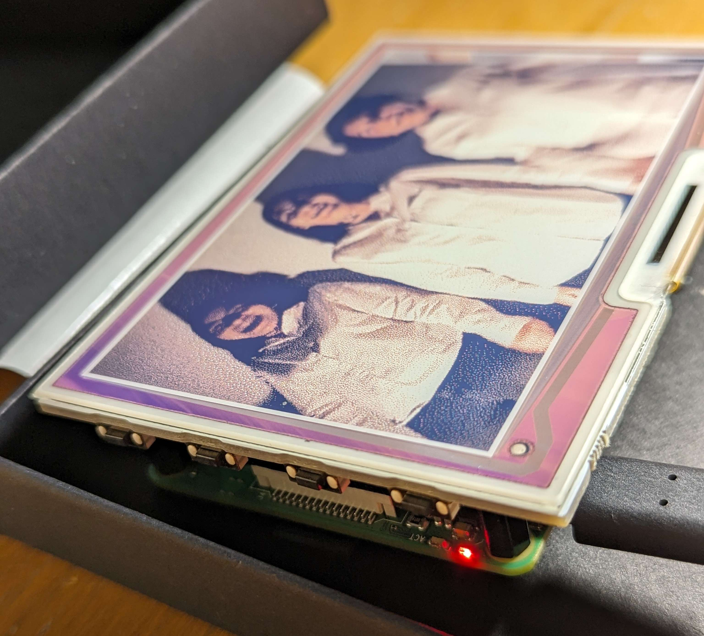

# pi-pic
A script to configure my Rasberry Pi 4 Model B with the [Inky Impression 4" (7 colour ePaper/eInk HAT).](https://shop.pimoroni.com/products/inky-impression-4?variant=39599238807635) Utilizes a private Discord server and bot to receive images and cycle through them randomly.



## Set Up 
1) After connecting the Pi and Inky, install the following dependencies
```
sudo pip3 install inky[rpi,example-depends]
sudo pip3 install discord.py
sudo pip3 install pillow
```

2) Clone this repository 
```
sudo git clone https://github.com/kiwijuice56/pi-pic
```

3) Create a Discord bot and server. In the server, create a single channel where you will interface with the bot. Create two files in the pi-pic directory: `CHANNEL.txt` and `TOKEN.txt` and copy the Discord channel's ID and the bot's token into each file respectively.

4) Run the script
```
sudo python3 pi-pic/bot.py
```

5) (Optional) To allow the script to start up at boot, edit the file:
```
sudo nano /etc/rc.local
```
And add the following line of code right before the exit line:
```
python3 /home/pi/pi-pic/bot.py &
```
Finally, uncomment the (near) final line of code in `bot.py` that adds a small delay to give your Pi time to connect to your internet:
```
# Uncomment for autostart
sleep(10)
```

## Usage
Send pictures in the selected channel to add them to the slideshow or send the text `clear` to remove all of the pictures. The slideshow will stop if there are no pictures. The bot's status will reflect the number of pictures currently in the slideshow. You can also send `update` to refresh this number.